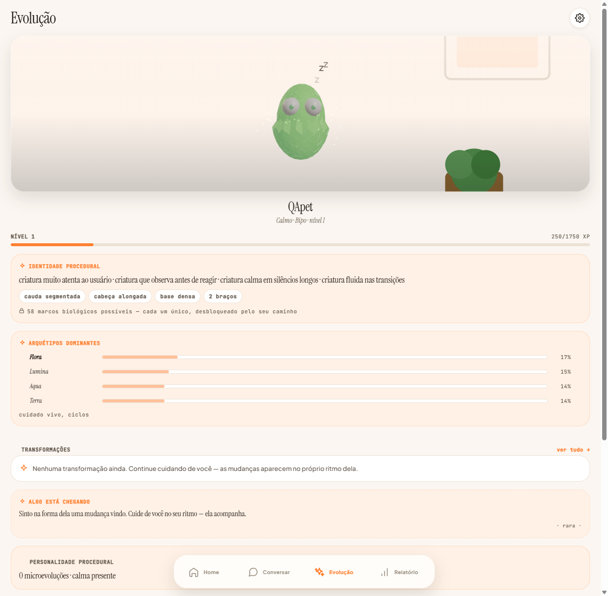
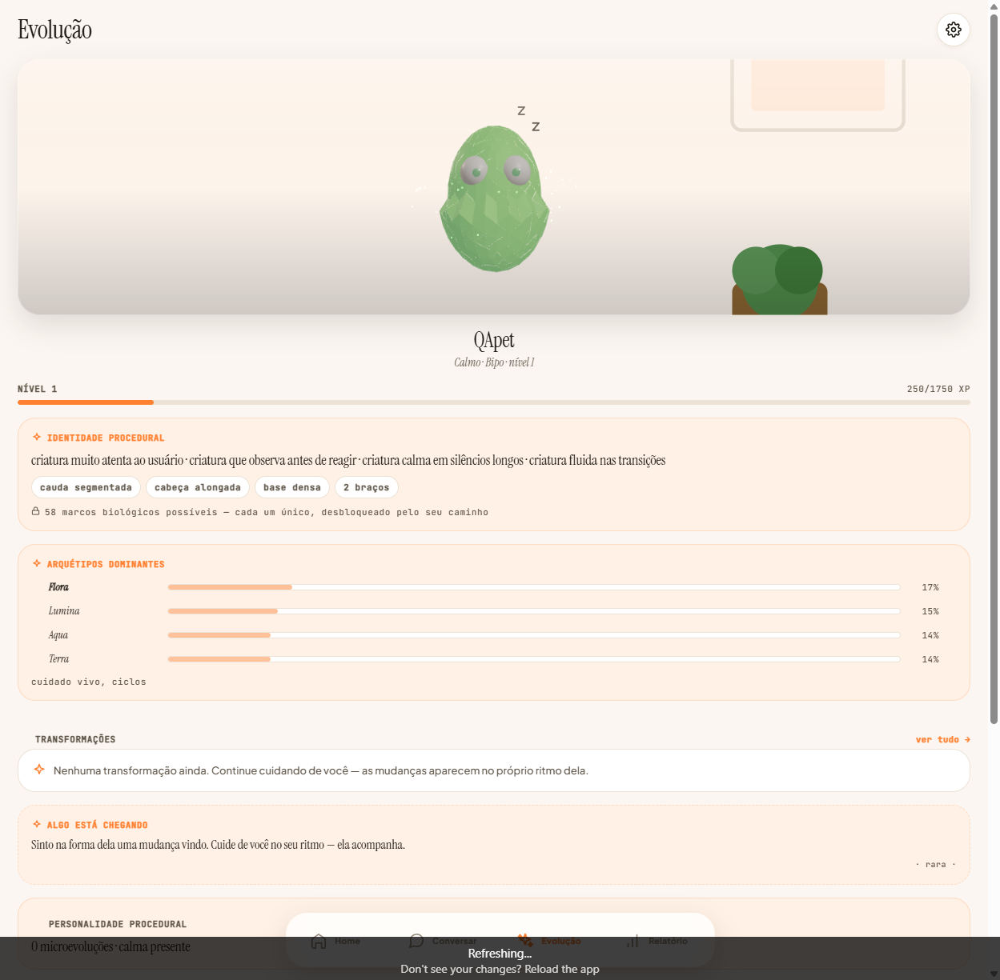
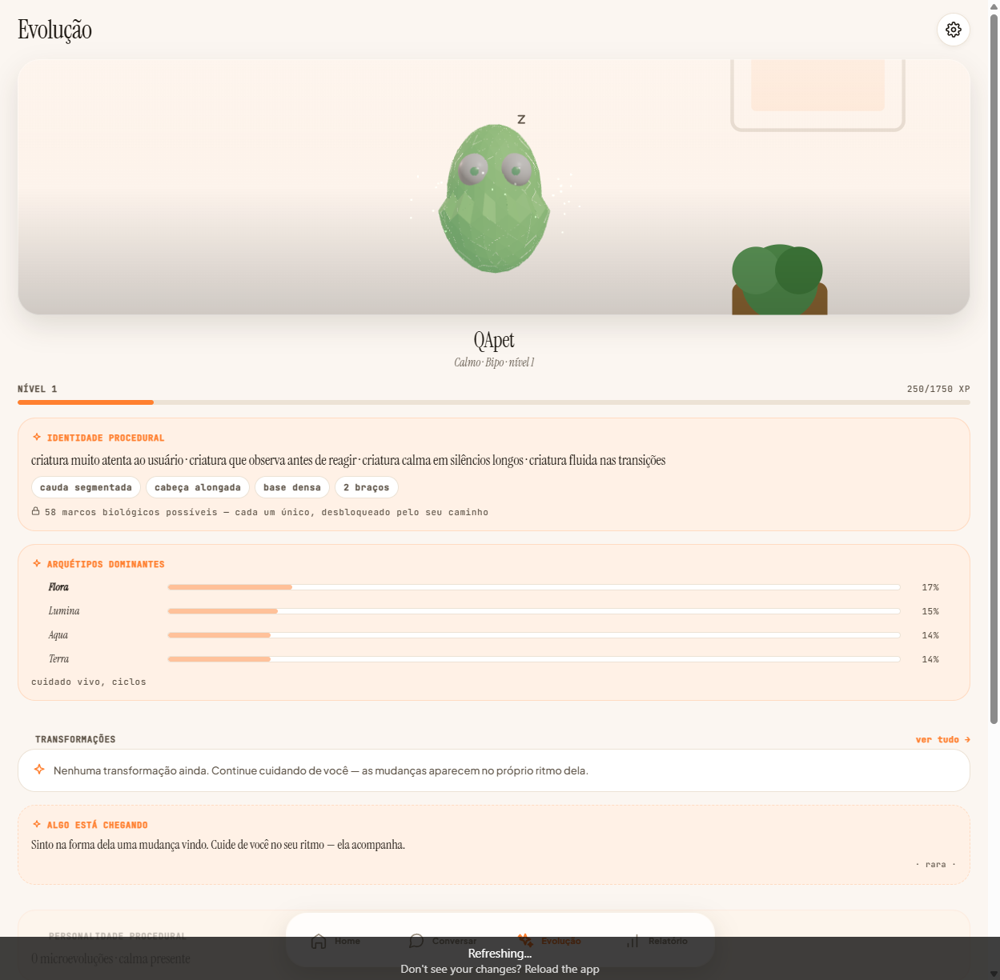
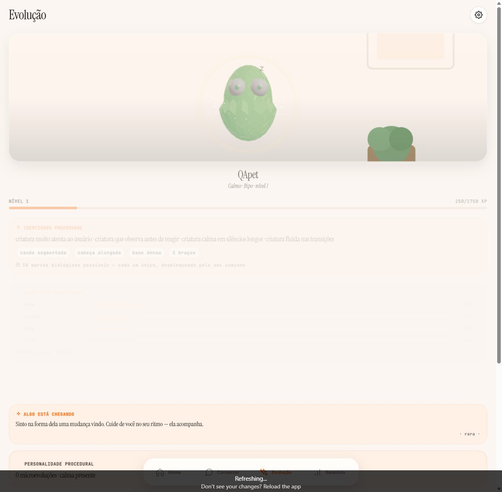
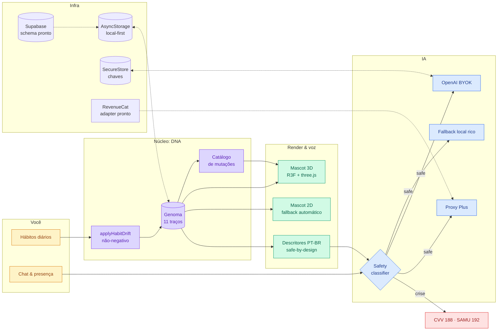
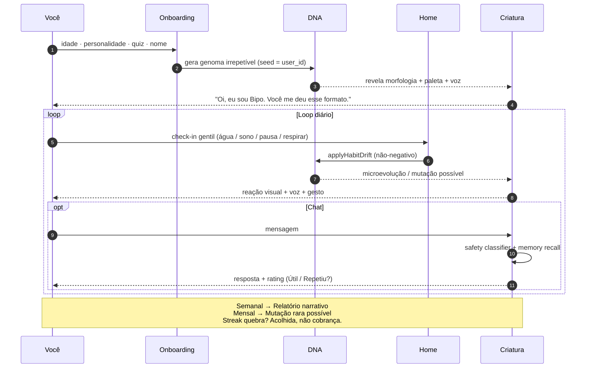

<div align="center">

<a href="https://github.com/felipemenezes25000-spec/mascote">
  
</a>

# Mascote

**Uma criatura digital procedural, única, que evolui com seus hábitos.**

<sub>Não é Tamagotchi. Não é chatbot. É <strong>identidade viva digital</strong> — em português, para quem quer cuidar de si com leveza.</sub>

<br/>

<p>
  <a href="app/mobile/app.json"></a>
  <a href="app/mobile/package.json"></a>
  <a href="app/mobile/tsconfig.json"></a>
  <a href="app/mobile/src/components/Mascot3D.tsx"></a>
  <a href="app/mobile/tests/guarantees/"></a>
  
</p>

<br/>

<table>
<tr>
<td align="center" width="25%">
  <br/>
  <sub><strong>Bebê</strong><br/>recém-eclodido</sub>
</td>
<td align="center" width="25%">
  <br/>
  <sub><strong>Criança</strong><br/>primeiros hábitos</sub>
</td>
<td align="center" width="25%">
  <br/>
  <sub><strong>Adolescente</strong><br/>identidade emergindo</sub>
</td>
<td align="center" width="25%">
  <br/>
  <sub><strong>Evoluído</strong><br/>seu reflexo vivo</sub>
</td>
</tr>
</table>

<sub>Quatro fases. <strong>Infinitas criaturas.</strong> Cada usuário recebe uma morfologia, paleta e voz determinadas pelo próprio <code>user_id</code> — nunca há duas iguais.</sub>

</div>

---

## Sumário

- [O que é](#o-que-é)
- [Por que existe](#por-que-existe)
- [Como funciona](#como-funciona)
- [A jornada do usuário (60 segundos por dia)](#a-jornada-do-usuário-60-segundos-por-dia)
- [As quatro promessas, travadas em código](#as-quatro-promessas-travadas-em-código)
- [Stack](#stack)
- [Quickstart](#quickstart)
- [Testes & Maestro E2E](#testes--maestro-e2e)
- [Estrutura do monorepo](#estrutura-do-monorepo)
- [Filosofia: identidade viva](#filosofia-identidade-viva)
- [Documentação rica](#documentação-rica)
- [Contribuir](#contribuir)

---

## O que é

Mascote é um app de **bem-estar gentil** em português brasileiro onde cada pessoa recebe uma **criatura procedural irrepetível**. Um genoma de **11 traços** molda:

- a **morfologia 3D** (corpo, olhos, antenas, postura, cauda),
- a **paleta** (HSL derivada do DNA),
- a **voz** (descritores PT-BR seguros, nunca o gene cru),
- o **comportamento autônomo** (idle, gestos, reações).

Hábitos reais — água, sono, exercício, meditação, leitura, respiração, journaling, outdoor, sol — **esculpem a biologia** da criatura ao longo do tempo. A evolução é **contínua e visível**, não cosmética.

> O app não tem mascote dentro dele. **O app _é_ o habitat do mascote.**

---

## Por que existe

| Apps tradicionais de bem-estar | Mascote |
|---|---|
| Avatar genérico ou skin estática | **DNA procedural** — morfologia, paleta e animação derivam do genoma |
| Fases lineares (ovo → adulto) | Evolução **contínua** por drift de hábitos, com mutações persistentes |
| Streak que culpa quem falha | **Sem culpa** — ausência nunca pune; decay não cruza o neutro |
| Chat solto com IA genérica | IA com **descritores PT-BR**; gene bruto **nunca** sai do device |
| Pet idêntico ao do amigo | Seed por `user_id` → criaturas **demonstravelmente distintas** |
| Gamificação punitiva | Check-in como **cuidado gentil** (~60s), não dever |

**Posicionamento honesto:** wellness e companhia. **Nunca** terapia, diagnóstico, cura. Em momentos de crise o app sempre entrega **CVV 188** / **SAMU 192** — imediato, sem IA, sem paywall.

---

## Como funciona



### Os 11 genes

| Gene | Influência visual / comportamental |
|---|---|
| `empathy` | olhos, inclinação, calor da paleta |
| `curiosity` | antenas reativas, dilatação da pupila |
| `creativity` | padrões corporais, cauda, caos visual |
| `discipline` | simetria, postura ereta, refinamento |
| `chaos` | assimetria, deformações, membros extras |
| `aggression` | espinhos, contorno defensivo |
| `resilience` | base densa, corpo robusto |
| `emotionalDepth` | expressividade, mudanças de cor |
| `socialEnergy` | aura, abertura, paleta quente |
| `adaptability` | fluidez de movimento |
| `intelligence` | proporção do crânio, brilho ocular |

Cada traço é um `float` em `[0.02, 0.98]`, determinístico via `mulberry32(seed)` + hash FNV-1a do `user_id`. Veja [`src/lib/dna/`](app/mobile/src/lib/dna/).

### As quatro personalidades-semente

Toda conta começa com **uma das quatro**, depois evolui livremente. Mesmo dentro de uma personalidade, dois usuários nunca recebem a mesma criatura — `genomeFromPreset(seed, preset, variance=0.1)`.

<table>
<tr>
<td align="center" width="25%"><strong>Bipo</strong><br/><sub>Calmo</sub><br/><code>empathy 0.82</code><br/><code>discipline 0.70</code></td>
<td align="center" width="25%"><strong>Zip</strong><br/><sub>Motivador</sub><br/><code>curiosity 0.85</code><br/><code>intelligence 0.65</code></td>
<td align="center" width="25%"><strong>Lulu</strong><br/><sub>Fofo</sub><br/><code>empathy 0.95</code><br/><code>emotionalDepth 0.85</code></td>
<td align="center" width="25%"><strong>Aro</strong><br/><sub>Sábio</sub><br/><code>intelligence 0.95</code><br/><code>discipline 0.82</code></td>
</tr>
</table>

---

## A jornada do usuário (60 segundos por dia)



---

## As quatro promessas, travadas em código

Testes de produto não são UX manual — são **promessas em código**. Se um destes testes falhar, o app deixou de cumprir o que prometemos. Rodar tudo: `npm run test:guarantees`.

| # | Promessa | O que travamos | Arquivo |
|---|---|---|---|
| **G1** | _"Essa criatura é minha, não um avatar genérico"_ | 200 user_ids → ≥ 90% paletas distintas · drift visível em 20 dias · drift **nunca regride** (300 runs `fast-check`) · decay nunca cruza 0.5 | [`g1-creature-is-mine.test.ts`](app/mobile/tests/guarantees/g1-creature-is-mine.test.ts) |
| **G2** | _"Check-in é gentil, não pune"_ | `replies.ts` proibido de conter "deveria", "fracassou", "vergonha"… · `reactToReturn(30d)` é sempre acolhedor · intensity=0 não penaliza | [`g2-checkin-gentle.test.ts`](app/mobile/tests/guarantees/g2-checkin-gentle.test.ts) |
| **G3** | _"Chat Plus é útil, não repetitivo, rápido"_ | ≥ 3 openers por personalidade · timeout ≤ 30s com `AbortController` · validator rejeita URL/`<script>`/markdown · cost guard honesto | [`g3-chat-plus.test.ts`](app/mobile/tests/guarantees/g3-chat-plus.test.ts) |
| **G4** | _"Potencial de assinar pós-beta preservado"_ | check-in nunca gateia · cancel **não apaga DNA** · paywall não dispara em `phase=ovo` · copy proibida de "agora ou nunca" / "última chance" | [`g4-subscription-potential.test.ts`](app/mobile/tests/guarantees/g4-subscription-potential.test.ts) |

Detalhe completo: [`docs/GUARANTEES.md`](docs/GUARANTEES.md).

> **Em crise:** 📞 **188 CVV** · 💬 cvv.org.br · 🏥 CAPS · 🚨 **192 SAMU** — instantâneo, sem IA, sem cobrança.

---

## Stack

| Camada | Escolhas |
|---|---|
| **UI** | React Native 0.74.5 · Expo SDK 51 · Expo Router 3.5 · Reanimated 3 · Gesture Handler · expo-haptics |
| **3D procedural** | React Three Fiber 8 · three.js 0.166 · expo-gl · fallback 2D automático com `ErrorBoundary` |
| **Tipografia** | Plus Jakarta Sans · Instrument Serif · JetBrains Mono · Quicksand (via `@expo-google-fonts`) |
| **Estado** | Zustand · AsyncStorage (local-first) · SecureStore (chaves BYOK) |
| **IA** | OpenAI BYOK opt-in · proxy Plus pronto (`EXPO_PUBLIC_AI_PROXY_URL`) · fallback local rico (TF-IDF + BM25 + sentiment + memory graph) |
| **Safety** | Ensemble classifier (regex + sentiment + Bayes) · output filter anti-clínico · CVV/SAMU imediato sem IA |
| **Billing** | Adapter RevenueCat pronto · demo guard (`isDemoBilling`, `isMockInProductionBuild`) · paywall ético testado |
| **Backend (preparado)** | Supabase schema completo: 12 tabelas + RLS + indexes + triggers (`docs/SUPABASE_SCHEMA.sql`) |
| **Testes** | Vitest (pool threads) · `fast-check` property-based (300 runs em decay) · Maestro 11 flows E2E |
| **Qualidade** | TypeScript strict · ESLint flat config · `npm run quality` = typecheck + lint + suíte completa |
| **Landing** | Next.js 14 (Tailwind), pt/en — `app/web/` |

---

## Quickstart

```bash
git clone https://github.com/felipemenezes25000-spec/mascote.git
cd mascote
npm install --prefix app/mobile

npm run web          # web preview em http://localhost:8081
npm test             # ~1.8k testes (~10s)
npm run typecheck    # 0 erros, strict mode
npm run quality      # typecheck + lint + suíte
```

### Rodar no celular (Expo Go)

```bash
cd app/mobile
cp .env.example .env       # configure variáveis (NÃO commitar)
npx expo start             # escaneie o QR no Expo Go
```

### OpenAI opcional (BYOK)

1. Gere uma chave em [platform.openai.com/api-keys](https://platform.openai.com/api-keys) com **spending limit baixo** (R$ 5 já basta para semanas).
2. App → **Settings** → **API Key**.
3. Chat fica online com system prompt anti-clínico — o gene **bruto nunca** sai do device.

> Sem chave? O fallback local roda 100% da experiência **offline**.

---

## Testes & Maestro E2E

### Vitest (unit + integration + property-based)

```bash
npm test                  # tudo (~10s, threads pool)
npm run test:unit         # lib, content, store, properties
npm run test:integration  # services, components, hooks, repositories
npm run test:security     # pentest + safety + DNA privacy
npm run test:ai           # safety classifier + providers + guards
npm run test:game         # evolution, memory, behavior engine
npm run test:subscription # paywall, triggers, cancel-preserva-DNA
npm run test:guarantees   # as 4 promessas (G1–G4)
npm run test:coverage     # gates: 70 lines / 66 branches
```

### Maestro (Android, Windows ou macOS)

```bash
# Setup automático no Windows (JDK 17 + SDK + AVD + Maestro)
npm run setup:e2e:win

# Subir emulador e rodar suíte crítica
npm run emulator:start
npm run test:e2e:critical   # onboarding + checkin + chat crise
npm run test:e2e            # 11 flows: onboarding, checkin, paywall, chat-safe, chat-crisis, settings-export, premium-reports, dynamic-text, dismiss-tour, setup-home…
```

Guia completo: [`app/mobile/docs/E2E_WINDOWS.md`](app/mobile/docs/E2E_WINDOWS.md).

---

## Estrutura do monorepo

```
mascote/
├── app/
│   ├── mobile/                  ← Expo 51 · RN 0.74 · ~57 telas (coração do produto)
│   │   ├── app/                 ← rotas Expo Router (onboarding, tabs, checkin, paywall…)
│   │   ├── src/
│   │   │   ├── lib/dna/         ← genoma, paleta, morfologia, drift sem culpa, mutações
│   │   │   ├── ai/              ← safety ensemble, providers (local/BYOK/proxy), guards
│   │   │   ├── analytics/       ← eventos tipados + consent gating + provider plugável
│   │   │   ├── components/      ← Mascot3D (split em 12), Mascot2D, MascotInteractive…
│   │   │   ├── components/ui/   ← Typography, LivingCard, ProgressPulse, CreatureHero…
│   │   │   ├── data/sync/       ← SyncEngine + OfflineMutationQueue (Supabase-ready)
│   │   │   ├── game/            ← evolution engine, behavior engine, memory graph
│   │   │   ├── lib/moments/     ← creatureMoments — bus pub/sub semântico
│   │   │   └── services/        ← subscription + billing provider + RevenueCat adapter
│   │   ├── tests/               ← ~1.8k testes Vitest + property-based
│   │   ├── tests/guarantees/    ← G1–G4: as 4 promessas testadas
│   │   ├── .maestro/            ← 11 fluxos E2E (paywall, crisis, onboarding…)
│   │   └── scripts/             ← audit-visual, coverage-gaps, setup-e2e-windows.ps1
│   └── web/                     ← landing Next.js 14 (pt/en)
├── docs/
│   ├── design/creature-evolution/  ← arte conceitual (v2-* atual, legacy/ histórico)
│   ├── screenshots/             ← capturas com valor permanente (YYYY-MM-DD/)
│   ├── CURRENT_STATE.md         ← verdade operacional
│   ├── GUARANTEES.md            ← as 4 promessas em detalhe
│   ├── LIVING_IDENTITY_DESIGN.md← manifesto do sistema visual
│   ├── INFRA_LAUNCH_PLAYBOOK.md ← passo a passo para sair de "código" → "beta pagando"
│   └── …                        ← 27 docs cobrindo IA, billing, sync, premium, copy
├── plano_mascote/               ← estratégia (7 partes)
├── docs/design/prototypes/      ← protótipos HTML standalone (criatura procedural etc.)
└── .github/workflows/           ← CI quality gate (typecheck + lint + coverage)
```

---

## Filosofia: identidade viva

> _"O app não tem mascote dentro dele. O app **é** o habitat do mascote."_  
> — [`docs/LIVING_IDENTITY_DESIGN.md`](docs/LIVING_IDENTITY_DESIGN.md)

Sete princípios invioláveis que guiam cada PR:

1. **Mascote é protagonista visual.** Toda tela central abre com `CreatureHero`. Nunca dashboard antes da criatura.
2. **Orgânico, não fintech.** Cantos `radius.lg` (22px), nunca `0`. Bordas em cor de palette, nunca cinza neutro.
3. **Paleta DNA-driven.** Cores derivam de `paletteFromGenome(dna)` quando faz sentido contextual.
4. **Tokens, sempre.** Sem hex inventado em telas. Sem `padding: 12`. Tudo via `theme.spacing.*` / `theme.colors.*`.
5. **Tipografia via `<Typography variant>`.** `<Text>` cru em telas é débito visual.
6. **Reação, não notificação.** Algo importante? A criatura **reage** (animation + `CreatureReactionToast`) via `creatureMoments.emit(...)` — não toast genérico do sistema.
7. **Sem culpa, sem cobrança.** Travado pela G2 — copy nunca acusa nem pune. Reativo, gentil, paciente.

E uma promessa técnica que vale repetir:

> **O genoma bruto nunca sai do device.** Para o OpenAI vão apenas descritores PT-BR seguros (`"olhar atento, postura suave"`). Travado em [`tests/security/dna-privacy-ai.test.ts`](app/mobile/tests/security/dna-privacy-ai.test.ts).

---

## Documentação rica

| Quando ler | Doc |
|---|---|
| **Sempre primeiro** — verdade operacional | [`docs/CURRENT_STATE.md`](docs/CURRENT_STATE.md) |
| Entender as 4 promessas testadas | [`docs/GUARANTEES.md`](docs/GUARANTEES.md) |
| Manifesto do sistema visual | [`docs/LIVING_IDENTITY_DESIGN.md`](docs/LIVING_IDENTITY_DESIGN.md) |
| Decidir cobrar · 5 pilares de assinatura | [`docs/GO_NO_GO_CHECKLIST.md`](docs/GO_NO_GO_CHECKLIST.md) |
| Preparar TestFlight / Play Internal | [`docs/BETA_RELEASE_CHECKLIST.md`](docs/BETA_RELEASE_CHECKLIST.md) |
| De "código pronto" a "beta pagando" | [`docs/INFRA_LAUNCH_PLAYBOOK.md`](docs/INFRA_LAUNCH_PLAYBOOK.md) |
| Plus honesto · RevenueCat · trial | [`docs/PREMIUM_STRATEGY.md`](docs/PREMIUM_STRATEGY.md) |
| Proxy IA · rate limit · custo | [`docs/AI_PRODUCTION_PLAN.md`](docs/AI_PRODUCTION_PLAN.md) |
| Sync multi-device | [`docs/SYNC_ARCHITECTURE.md`](docs/SYNC_ARCHITECTURE.md) |
| Auditoria de débito visual | [`docs/VISUAL_DEBT.md`](docs/VISUAL_DEBT.md) |
| Textos App Store · paywall · onboarding | [`docs/COMMERCIAL_COPY.md`](docs/COMMERCIAL_COPY.md) |
| E2E no Windows com Maestro | [`app/mobile/docs/E2E_WINDOWS.md`](app/mobile/docs/E2E_WINDOWS.md) |
| Índice completo | [`docs/README.md`](docs/README.md) |

---

## Contribuir

```bash
npm install --prefix app/mobile
npm run quality                # antes de qualquer PR
npm --prefix app/mobile run test:guarantees   # ao tocar em DNA / copy / paywall
```

Detalhes e convenções em [`CONTRIBUTING.md`](CONTRIBUTING.md).

---

<div align="center">


### Cuide de você. Seu Mascote evolui junto.

<sub>30 segundos por dia. Sem cobrança moral. Sem promessa médica.<br/>
Com uma criatura que é <strong>só sua</strong>.</sub>

<br/><br/>

<sub>
  <strong>Digital Living Identity</strong> · feito no Brasil · 2026<br/>
  Wellness, não terapia. Em crise: <strong>CVV 188</strong> · <strong>SAMU 192</strong>.
</sub>

</div>
