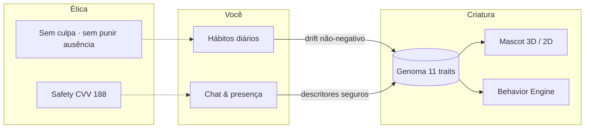
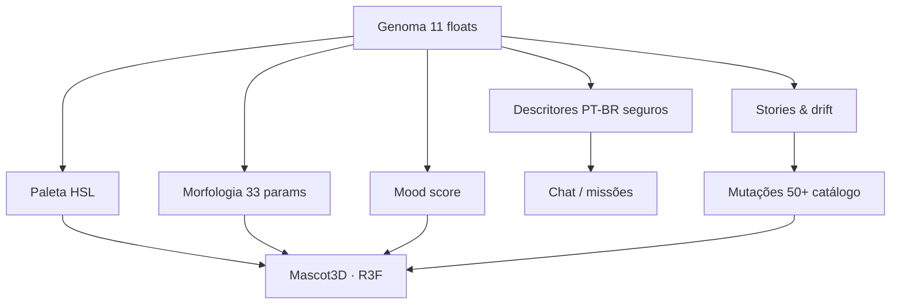
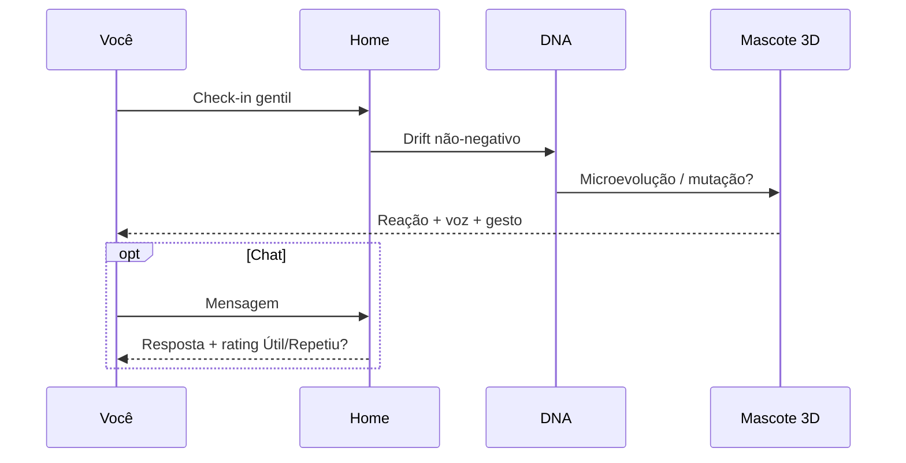
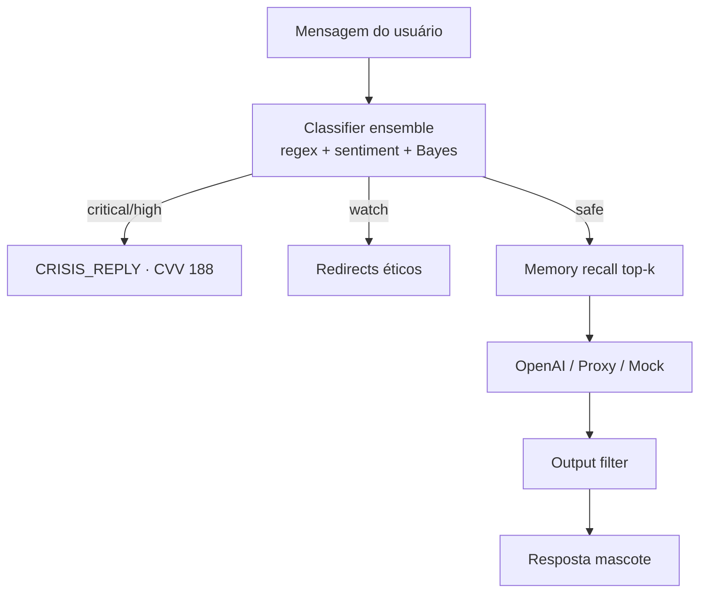

<div align="center">

<!-- Hero -->
<picture>
  <source media="(prefers-color-scheme: dark)" srcset="https://capsule-render.vercel.app/api?type=waving&color=0:7C3AED,50:10B981,100:0EA5E9&height=220&section=header&text=Mascote&fontSize=72&fontColor=ffffff&animation=fadeIn&fontAlignY=38&desc=Digital%20Living%20Identity%20%C2%B7%20PT-BR&descSize=18&descAlignY=62&descAlign=62"/>
  
</picture>

<br/>

**Uma criatura digital procedural, única e viva — que evolui com seus hábitos, sem culpa e com carinho.**

*Não é Tamagotchi. Não é chatbot genérico. É identidade digital biológica em português.*

<br/>

[](app/mobile/tests/)
[](app/mobile/vitest.config.ts)
[](.github/workflows/ci.yml)
[](app/mobile/tsconfig.json)
[](app/mobile/app.json)
[](app/mobile/package.json)
[](app/mobile/src/components/Mascot3D.tsx)

<br/>

[Começar](#-quick-start) · [DNA](#-genoma--evolução) · [Arquitetura](#-arquitetura) · [Plus](#-mascote-plus) · [Beta](#-analytics--beta) · [Docs](#-documentação)

<br/>

</div>

---

## Índice

<table>
<tr>
<td width="50%" valign="top">

**Produto**
- [O que é](#-o-que-é-o-mascote)
- [Por que é diferente](#-por-que-é-diferente)
- [Genoma & evolução](#-genoma--evolução)
- [Loop diário](#-loop-diário-60-segundos)
- [Mascote Plus](#-mascote-plus)

</td>
<td width="50%" valign="top">

**Engenharia**
- [Arquitetura](#-arquitetura)
- [Safety & IA](#️-safety--ia)
- [Analytics](#-analytics--beta)
- [Quick Start](#-quick-start)
- [Qualidade](#-qualidade)
- [Documentação](#-documentação)

</td>
</tr>
</table>

---

## O que é o Mascote

O **Mascote** é um app de bem-estar gentil onde cada pessoa recebe uma **criatura procedural irrepetível**. Seu genoma de 11 traços molda aparência 3D, comportamento autônomo, tom de voz e respostas — enquanto **hábitos reais** (água, sono, movimento, pausa) esculpem a biologia ao longo do tempo.



> **Posicionamento:** wellness e companhia — **nunca** terapia, diagnóstico ou promessa médica.

---

## Por que é diferente

| Apps tradicionais | Mascote |
|-------------------|---------|
| Avatar / skin estática | **DNA procedural** — morfologia + paleta + animação derivadas |
| Fases lineares (ovo → adulto) | Evolução **contínua** por drift de hábitos |
| Streak que culpa | **Sem culpa** — ausência não pune; decay não cruza o neutro |
| Chat solto | IA com **descritores PT-BR** — gene bruto **nunca** sai do device |
| Pet genérico | Seed por `user_id` → criaturas **demonstravelmente distintas** |
| Gamificação punitiva | Check-in como **cuidado gentil** (~60s), não dever |

---

## Genoma & evolução

### 11 genes, um organismo

Cada traço é um `float` em `[0.02, 0.98]`, determinístico via `mulberry32(seed)` + hash FNV-1a do usuário:

| Gene | Influência visual / comportamental |
|------|----------------------------------|
| `empathy` | Olhos, inclinação, calor |
| `curiosity` | Antenas, pupila, exploração |
| `creativity` | Padrões, cauda, caos visual |
| `discipline` | Simetria, postura |
| `chaos` | Assimetria, deformações |
| `aggression` | Espinhos, contorno defensivo |
| `resilience` | Corpo denso, robustez |
| `emotionalDepth` | Expressividade, cor |
| `socialEnergy` | Aura, paleta aberta |
| `adaptability` | Fluidez de movimento |
| `intelligence` | Crânio, brilho ocular |

<details>
<summary><strong>Pipeline Genome → Mundo</strong></summary>



**Princípio inviolável:** `applyHabitDrift` é **sempre não-negativo**. Garantido por property tests (`fast-check`).

</details>

### Mutações & comportamento

- **50+ mutações** catalogadas (comum → lendária), overlays visuais **sem mutar DNA bruto**
- **Behavior Engine** — utility AI a cada 30s: milestone, retorno, DNA-driven, temporal, idle
- **Gestos:** tap · double-tap · long-press · carinho (`MascotInteractive`)
- **Voz procedural** (Web Audio) modulada pelo genoma

---

## Loop diário (60 segundos)



---

## Mascote Plus

Monetização **honesta**: free é completo; Plus aprofunda. Billing **arquiteturalmente pronto** — cobrança real após RevenueCat + lojas ([checklist](docs/PREMIUM_STRATEGY.md)).

| | Free | Plus |
|---|:---:|:---:|
| Criatura viva + evolução + drift | ✅ | ✅ |
| Missões, streak, XP (sem culpa) | ✅ | ✅ |
| Chat | Local + BYOK | Proxy 50/dia* |
| Mutações raras/épicas | — | ✅ |
| Relatório semanal | Prévia | Narrativa completa |
| Memória | 50 | 200 + graph |
| Sync multi-device | — | Supabase* |

\* *Após deploy de infra (proxy IA + backend).*

**Preços alvo:** R$ 19,90/mês · R$ 149,90/ano · trial 7 dias · cancelamento na loja **sem perder DNA** ([teste Pilar 5](app/mobile/tests/subscription/pillar5-cancel-dna.test.ts)).

---

## Arquitetura

### Monorepo

```
mascote/
├── app/mobile/          ← Expo 51 · RN 0.74 · ~48 rotas · coração do produto
│   ├── src/
│   │   ├── lib/dna/     ← genoma, mutações, drift
│   │   ├── ai/          ← safety, proxy, rate limit, fallback
│   │   ├── analytics/   ← eventos tipados + consent
│   │   ├── components/  ← Mascot3D, UI, ChatReplyRating
│   │   └── services/    ← subscription, sync
│   └── tests/           ← 120 arquivos · 1848 testes
├── app/web/             ← Landing Next.js 14
├── docs/                ← verdade operacional + GO/NO-GO beta
└── .github/workflows/   ← CI quality gate
```

### Stack

| Camada | Tecnologia |
|--------|------------|
| UI | React Native 0.74 · Expo Router 3.5 · Reanimated 3 |
| 3D | React Three Fiber 8 · three.js 0.166 · fallback 2D automático |
| Estado | Zustand 4.5 |
| Persistência | AsyncStorage · SecureStore (BYOK) |
| IA | OpenAI BYOK · proxy preparado · fallback local rico |
| ML on-device | TF-IDF · BM25 · sentiment · memory graph |
| Testes | Vitest 4 · Maestro E2E · fast-check |
| Sync (prep) | Supabase schema + `SyncEngine` stub |

---

## Safety & IA



**Garantias com testes:**

| Garantia | Teste |
|----------|-------|
| DNA bruto nunca no payload OpenAI | `tests/security/dna-privacy-ai.test.ts` |
| Dois users ≠ mesma criatura | fast-check 200 runs |
| Ausência não pune | decay property 300 runs |
| Mutação não altera genoma | integração DNA |

Em crise: **188 CVV** · **cvv.org.br** · **CAPS** · **192 SAMU** — imediato, sem IA, sem paywall.

---

## Analytics & beta

Camada de produto instrumentada para **decidir com dados** quando cobrar:

| Evento | Uso |
|--------|-----|
| `checkin_completed` | Duração · path · hábito |
| `mascot_gesture` | Vínculo com a criatura |
| `ai_reply_*` | Latência · proxy vs local |
| `ai_reply_rated` | Útil · Repetiu? (UI no chat) |
| `subscription_*` | Cancel/restore sem perder DNA |
| `weekly_report_viewed` | Valor do Plus |

**Checklist completo:** [`docs/GO_NO_GO_CHECKLIST.md`](docs/GO_NO_GO_CHECKLIST.md) — retenção D7, polish em device, 5 pilares de assinatura.

| Gate | Status |
|------|--------|
| Beta fechado (código) | 🟢 quality gate verde |
| Cobrar na loja | 🔴 RevenueCat + proxy + EAS |
| Loja pública | 🔴 após 2 rodadas de beta |

---

## Quick Start

### Monorepo (recomendado)

```bash
git clone https://github.com/felipemenezes25000-spec/mascote.git
cd mascote
npm install --prefix app/mobile

npm run web          # http://localhost:8081
npm test             # 1848 testes · ~10s
npm run typecheck
npm run quality      # typecheck + lint + coverage
```

### Mobile nativo

```bash
cd app/mobile
cp .env.example .env    # não commitar
npx expo start          # Expo Go · QR code
```

### OpenAI (opcional)

Settings → API Key → chat online com system prompt anti-clínico. **Sem chave:** fallback local 100% funcional.

---

## Qualidade

<div align="center">

| Métrica | Valor |
|---------|-------|
| Testes | **1.848** |
| Arquivos de teste | **120** |
| Coverage (lines) | **72.9%** enforced ≥70% |
| Typecheck | 0 errors |
| Maestro E2E | 8 flows (CI gatado) |
| Tempo suite | ~10s |

</div>

Scripts granulares: `test:unit` · `test:security` · `test:ai` · `test:subscription` · `test:game`.

Antes de PR:

```bash
npm run quality
```

---

## Documentação

| Doc | Conteúdo |
|-----|----------|
| [**CURRENT_STATE.md**](docs/CURRENT_STATE.md) | Verdade operacional — **leia primeiro** |
| [**GO_NO_GO_CHECKLIST.md**](docs/GO_NO_GO_CHECKLIST.md) | Métricas beta · 5 pilares · cobrança |
| [**BETA_RELEASE_CHECKLIST.md**](docs/BETA_RELEASE_CHECKLIST.md) | TestFlight / Play Internal |
| [**PREMIUM_STRATEGY.md**](docs/PREMIUM_STRATEGY.md) | Plus honesto · RevenueCat |
| [**AI_PRODUCTION_PLAN.md**](docs/AI_PRODUCTION_PLAN.md) | Proxy · rate limit · custo |
| [**SECURITY_AUDIT.md**](docs/SECURITY_AUDIT.md) | npm audit · Expo SDK 53 |
| [**COMMERCIAL_COPY.md**](docs/COMMERCIAL_COPY.md) | App Store · paywall PT-BR |
| [**docs/README.md**](docs/README.md) | Índice completo |

---

## Roadmap (resumo)

| Entrega | Estado |
|---------|--------|
| DNA + Mascot3D + mutações + behavior | ✅ |
| Home mascote-centrada + memórias + arquétipos | ✅ |
| Analytics + guards IA + billing scaffold | ✅ |
| Chat rating + eventos pilares | ✅ |
| Proxy IA deploy | 🔜 |
| RevenueCat + lojas | 🔜 |
| Supabase sync live | 🔜 |
| Push nativo | 🔜 |

Detalhe: [`ROADMAP_DIGITAL_LIVING_IDENTITY.md`](docs/ROADMAP_DIGITAL_LIVING_IDENTITY.md)

---

## Contribuir

Projeto em desenvolvimento ativo. Veja [CONTRIBUTING.md](CONTRIBUTING.md).

```bash
npm run typecheck && npm test && npm run lint
```

---

## Time

**Felipe Menezes** · [@felipemenezes25000-spec](https://github.com/felipemenezes25000-spec)  
Co-fundador: **Renato**

---

<div align="center">

<br/>

### Cuide de você. Seu Mascote evolui junto.

*30 segundos por dia. Sem cobrança moral. Sem promessa médica. Com uma criatura que é só sua.*

<br/>

[](https://github.com/felipemenezes25000-spec/mascote)

<sub>Digital Living Identity · feito com 💜 no Brasil · 2026</sub>

</div>
