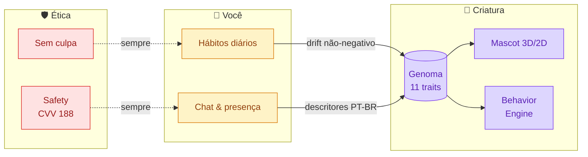
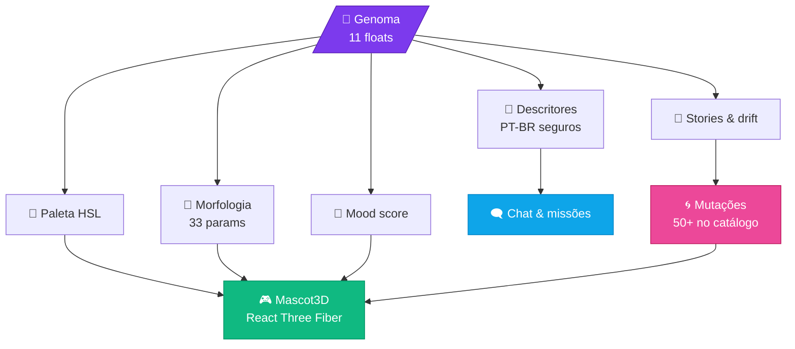
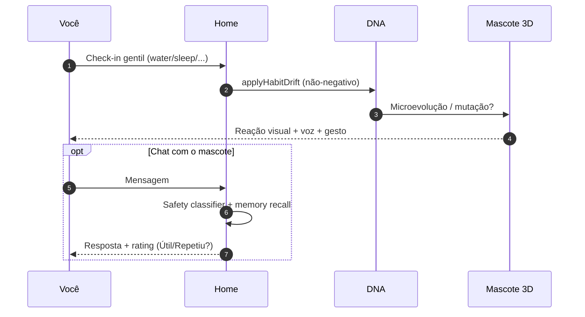
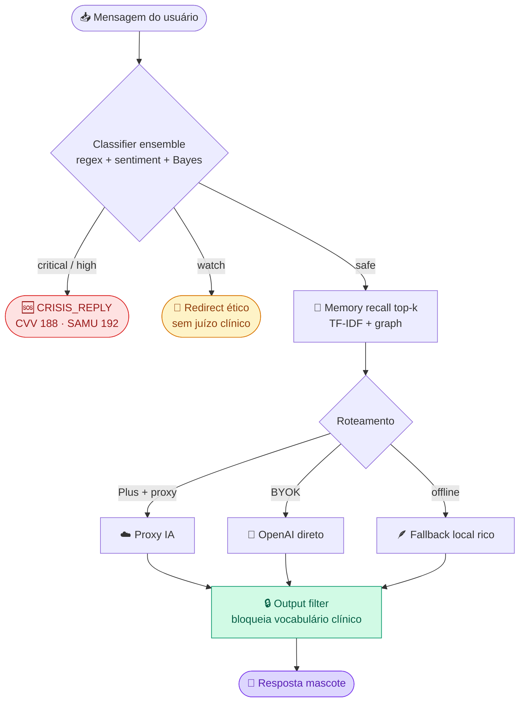

<div align="center">

<a href="https://github.com/felipemenezes25000-spec/mascote">
  
</a>

<br/>

<!-- Banner animado -->


<br/>

<h3>
  <em>Uma criatura digital procedural, única e viva — que evolui com seus hábitos.</em>
</h3>

<p>
  <strong>Sem culpa. Sem promessa médica. Com uma criatura que é só sua.</strong>
</p>

<sub>Não é Tamagotchi. Não é chatbot. É <strong>identidade digital biológica</strong> — em português, para quem quer cuidar de si com leveza.</sub>

<br/><br/>

<!-- Badges principais -->
<p>
  <a href="app/mobile/tests/"></a>
  <a href="app/mobile/vitest.config.ts"></a>
  <a href=".github/workflows/ci.yml"></a>
  <a href="app/mobile/tsconfig.json"></a>
</p>

<p>
  <a href="app/mobile/app.json"></a>
  
  <a href="app/mobile/src/components/Mascot3D.tsx"></a>
  
  
</p>

<br/>

<h4>
  <a href="#-quick-start">Começar</a> ·
  <a href="#-genoma--evolução">DNA</a> ·
  <a href="#-arquitetura">Arquitetura</a> ·
  <a href="#-mascote-plus">Plus</a> ·
  <a href="#-analytics--beta">Beta</a> ·
  <a href="#-documentação">Docs</a>
</h4>

</div>

---

<table>
<tr>
<td width="50%" valign="top">

### Produto
- [O que é](#-o-que-é-o-mascote)
- [Por que é diferente](#-por-que-é-diferente)
- [Personalidades base](#-personalidades-base)
- [Genoma & evolução](#-genoma--evolução)
- [Loop diário](#-loop-diário-60-segundos)
- [Mascote Plus](#-mascote-plus)

</td>
<td width="50%" valign="top">

### Engenharia
- [Arquitetura](#-arquitetura)
- [Safety & IA](#-safety--ia)
- [Analytics & beta](#-analytics--beta)
- [Quick Start](#-quick-start)
- [Qualidade](#-qualidade)
- [Roadmap](#-roadmap)
- [Documentação](#-documentação)

</td>
</tr>
</table>

---

## 🌱 O que é o Mascote

O **Mascote** é um app de bem-estar onde cada pessoa recebe uma **criatura procedural irrepetível**. Seu genoma de 11 traços molda aparência 3D, comportamento autônomo, tom de voz e respostas — enquanto **hábitos reais** (água, sono, movimento, pausa) esculpem a biologia da criatura ao longo do tempo.



> **Posicionamento honesto:** wellness e companhia. **Nunca** terapia, diagnóstico ou cura. Em momentos de crise, o app sempre entrega CVV 188 / SAMU 192 — instantâneo, sem IA, sem paywall.

---

## ✨ Por que é diferente

<table>
<tr>
<th width="50%">😐 Apps tradicionais</th>
<th width="50%">🌱 Mascote</th>
</tr>
<tr>
<td>Avatar / skin estática</td>
<td><strong>DNA procedural</strong> — morfologia, paleta e animação derivadas do genoma</td>
</tr>
<tr>
<td>Fases lineares (ovo → adulto)</td>
<td>Evolução <strong>contínua</strong> por drift de hábitos, com mutações persistentes</td>
</tr>
<tr>
<td>Streak que culpa quem falha</td>
<td><strong>Sem culpa</strong> — ausência nunca pune; decay não cruza o neutro</td>
</tr>
<tr>
<td>Chat solto com IA genérica</td>
<td>IA com <strong>descritores PT-BR</strong> seguros; gene bruto <strong>nunca</strong> sai do device</td>
</tr>
<tr>
<td>Pet idêntico ao do amigo</td>
<td>Seed por <code>user_id</code> → criaturas <strong>demonstravelmente distintas</strong></td>
</tr>
<tr>
<td>Gamificação punitiva</td>
<td>Check-in como <strong>cuidado gentil</strong> (~60s), não dever</td>
</tr>
</table>

---

## 🎭 Personalidades base

Cada nova conta começa com **uma das 4 personalidades**, depois evolui livremente por hábitos. Mesmo dentro de uma personalidade, **dois usuários nunca recebem a mesma criatura** — `genomeFromPreset(seed, preset, variance=0.1)`.

<table>
<tr>
<td align="center" width="25%">


🌙 **Bipo**

`empathy 0.82`  
`discipline 0.70`

<sub>pausa · sono · respiração</sub>

</td>
<td align="center" width="25%">


⚡ **Zip**

`curiosity 0.85`  
`intelligence 0.65`

<sub>rotina · foco · movimento</sub>

</td>
<td align="center" width="25%">


💛 **Lulu**

`empathy 0.95`  
`emotionalDepth 0.85`

<sub>presença · carinho · leveza</sub>

</td>
<td align="center" width="25%">


📚 **Aro**

`intelligence 0.95`  
`discipline 0.82`

<sub>reflexão · leitura · pausa</sub>

</td>
</tr>
</table>

---

## 🧬 Genoma & evolução

### 11 genes, um organismo

Cada traço é um `float` em `[0.02, 0.98]`, determinístico via `mulberry32(seed)` + hash FNV-1a do `user_id`.

| Gene | Influência visual / comportamental |
|------|------------------------------------|
| `empathy` | Olhos, inclinação, calor da paleta |
| `curiosity` | Antenas reativas, dilatação da pupila |
| `creativity` | Padrões corporais, cauda, caos visual |
| `discipline` | Simetria, postura ereta, refinamento |
| `chaos` | Assimetria, deformações, membros extras |
| `aggression` | Espinhos, contorno defensivo |
| `resilience` | Base densa, corpo robusto |
| `emotionalDepth` | Expressividade, mudanças de cor |
| `socialEnergy` | Aura, abertura, paleta quente |
| `adaptability` | Fluidez de movimento |
| `intelligence` | Proporção do crânio, brilho ocular |

<details>
<summary><strong>📐 Pipeline Genome → Mundo</strong></summary>



**Princípio inviolável:** `applyHabitDrift` é **sempre não-negativo**. Garantido por property tests com `fast-check` (300 runs em decay).

</details>

### Hábitos esculpem biologia

| Hábito | Genes reforçados |
|--------|------------------|
| 💧 Água | resilience · adaptability |
| 😴 Sono | discipline · resilience · emotionalDepth |
| 🏋️ Exercício | resilience · adaptability · socialEnergy |
| 🧘 Meditação | empathy · emotionalDepth · discipline |
| 📖 Leitura | intelligence · curiosity · creativity |
| ✍️ Journaling | emotionalDepth · empathy · intelligence |
| 🌬️ Respiração | empathy · emotionalDepth · discipline |
| 🌳 Outdoor | socialEnergy · adaptability · curiosity |
| ☀️ Sol | resilience · socialEnergy · emotionalDepth |

### Mutações persistentes

50+ no catálogo, 4 raridades, condições compostas. Cada mutação é **overlay visual** — o DNA bruto **nunca** muta.

| Raridade | Exemplo | Condição |
|----------|---------|----------|
| 🟢 Comum | 📡 Antenas reativas | curiosity > 0.7 + 15× outdoor |
| 🔵 Rara | 🧱 Estrutura firme | resilience > 0.7 + discipline > 0.65 + 25× exercise |
| 🟣 Épica | 🌀 Padrões emergentes | creativity > 0.75 + chaos > 0.5 + 21 dias |
| 🟡 Lendária | 🌌 Forma bioluminescente | 4 genes > 0.7 + streak 30 + 60 dias |

---

## 🌀 Loop diário (60 segundos)



---

## ✨ Mascote Plus

Monetização **honesta**: free é completo, Plus aprofunda. Billing **arquiteturalmente pronto** — cobrança real após RevenueCat + lojas. Detalhes: [`docs/PREMIUM_STRATEGY.md`](docs/PREMIUM_STRATEGY.md).

<table>
<tr>
<th></th>
<th align="center">🆓 Free</th>
<th align="center">✨ Plus</th>
</tr>
<tr>
<td>Criatura viva, evolução, drift contínuo</td>
<td align="center">✅</td>
<td align="center">✅</td>
</tr>
<tr>
<td>Missões, streak, XP (sem culpa)</td>
<td align="center">✅</td>
<td align="center">✅</td>
</tr>
<tr>
<td>Safety completo (CVV/CAPS/SAMU)</td>
<td align="center">✅</td>
<td align="center">✅</td>
</tr>
<tr>
<td>Chat</td>
<td align="center">Local + BYOK</td>
<td align="center">Proxy 50/dia¹</td>
</tr>
<tr>
<td>Mutações raras / épicas / lendárias</td>
<td align="center">—</td>
<td align="center">✅</td>
</tr>
<tr>
<td>Relatório semanal</td>
<td align="center">Prévia</td>
<td align="center">Narrativa completa</td>
</tr>
<tr>
<td>Memória</td>
<td align="center">50 itens</td>
<td align="center">200 + graph rerank</td>
</tr>
<tr>
<td>Sync multi-device</td>
<td align="center">—</td>
<td align="center">Supabase opt-in¹</td>
</tr>
</table>

<sub>¹ Após deploy de infra externa (proxy IA + backend Supabase).</sub>

**Preços alvo:** R$ 19,90/mês · R$ 149,90/ano · trial 7 dias.  
**Cancelamento na loja, sem perder DNA** → validado em [`tests/subscription/pillar5-cancel-dna.test.ts`](app/mobile/tests/subscription/pillar5-cancel-dna.test.ts).

---

## 📐 Arquitetura

### Monorepo

```
mascote/
├── app/
│   ├── mobile/                  ← 🎯 Expo 51 · RN 0.74 · ~48 rotas (coração do produto)
│   │   ├── app/                 ← Expo Router (telas)
│   │   ├── src/
│   │   │   ├── lib/dna/         ← genoma, mutações, drift sem culpa
│   │   │   ├── ai/              ← safety, proxy, rate limit, fallback local
│   │   │   ├── analytics/       ← eventos tipados + consent gating
│   │   │   ├── components/      ← Mascot3D (split em 12), MascotInteractive, ChatReplyRating
│   │   │   ├── data/sync/       ← SyncEngine, OfflineMutationQueue (prep Supabase)
│   │   │   ├── game/            ← evolution, memory, behavior engine
│   │   │   └── services/        ← subscription, billing provider
│   │   └── tests/               ← 120 arquivos · 1848 testes Vitest + Maestro E2E
│   └── web/                     ← Landing Next.js 14 (pt/en)
├── docs/                        ← CURRENT_STATE + GO/NO-GO + roadmap
├── plano_mascote/               ← Estratégia (7 partes)
└── .github/workflows/           ← CI quality gate (typecheck + lint + coverage)
```

### Stack

<table>
<tr>
<td align="center" width="20%">

**UI**

React Native 0.74  
Expo Router 3.5  
Reanimated 3

</td>
<td align="center" width="20%">

**3D**

React Three Fiber 8  
three.js 0.166  
Fallback 2D auto

</td>
<td align="center" width="20%">

**IA**

OpenAI BYOK  
Proxy preparado  
Fallback local

</td>
<td align="center" width="20%">

**ML on-device**

TF-IDF · BM25  
Sentiment  
Memory graph

</td>
<td align="center" width="20%">

**Persistência**

AsyncStorage  
SecureStore (BYOK)  
Supabase schema

</td>
</tr>
</table>

---

## 🛡️ Safety & IA



### Garantias provadas com testes

| Garantia | Onde |
|----------|------|
| DNA bruto **nunca** no payload OpenAI | [`tests/security/dna-privacy-ai.test.ts`](app/mobile/tests/security/dna-privacy-ai.test.ts) |
| Dois usuários ≠ mesma criatura | fast-check 200 runs |
| Ausência **nunca** pune | property test decay 300 runs |
| Cancel **não** apaga DNA / histórico | [`tests/subscription/pillar5-cancel-dna.test.ts`](app/mobile/tests/subscription/pillar5-cancel-dna.test.ts) |
| Mutação **não** muta genoma | integração DNA |
| API key **nunca** em log | pentest de redaction |

**Em crise:** 📞 **188 CVV** · 💬 cvv.org.br · 🏥 CAPS · 🚨 **192 SAMU** — imediato, sem IA, sem cobrança.

---

## 📊 Analytics & beta

Camada de produto instrumentada para **decidir com dados** quando cobrar — não com feeling.

| Evento | Para que serve |
|--------|----------------|
| `checkin_completed` | Duração (Pilar 2: <60s gentil) · path · hábito |
| `mascot_gesture` | Vínculo (Pilar 1: criatura "minha") |
| `ai_reply_requested` / `succeeded` / `failed` | Latência · proxy vs local (Pilar 3) |
| `ai_reply_rated` | Útil ou repetiu? (UI no chat) |
| `weekly_report_viewed` | Valor do Plus (Pilar 4) |
| `subscription_cancelled` / `restored` | Confiança no cancel (Pilar 5) |
| `mutation_unlocked` · `first_microevolution_seen` | Engajamento estrutural |

📋 **Checklist completo de cobrança:** [`docs/GO_NO_GO_CHECKLIST.md`](docs/GO_NO_GO_CHECKLIST.md)  
**Critérios:** retenção D1/D7/D14 · 5 pilares de assinatura · polish em 4 tiers de device.

### Estado dos gates

| Gate | Status |
|------|:------:|
| ✅ Quality gate (typecheck + lint + 1848 testes) | 🟢 |
| 🚧 EAS build + TestFlight / Play Internal | 🟡 |
| 💳 Cobrança real (RevenueCat SDK + lojas) | 🔴 |
| ☁️ Proxy IA deployado (Plus inclui chat cloud) | 🔴 |
| 🔄 Supabase sync live | 🔴 |
| 🌐 Loja pública | 🔴 |

---

## 🚀 Quick Start

### Monorepo (recomendado)

```bash
git clone https://github.com/felipemenezes25000-spec/mascote.git
cd mascote
npm install --prefix app/mobile

npm run web          # → http://localhost:8081
npm test             # 1848 testes em ~10s
npm run typecheck    # 0 errors
npm run quality      # typecheck + lint + coverage gated
```

### Mobile (nativo via Expo)

```bash
cd app/mobile
cp .env.example .env      # NÃO commitar
npx expo start            # Expo Go → escaneie o QR
```

### OpenAI (opcional, BYOK)

1. Gere uma key em [platform.openai.com/api-keys](https://platform.openai.com/api-keys) com **spending limit baixo** (R$ 5).
2. App → **Settings** → **API Key**.
3. Chat fica online com system prompt anti-clínico.

> 💡 **Sem chave:** fallback local 100% funcional — toda a experiência roda offline.

---

## ✅ Qualidade

<div align="center">

<table>
<tr>
<td align="center"><strong>🧪 Testes</strong><br/><sub>1.848 passing</sub></td>
<td align="center"><strong>📁 Suites</strong><br/><sub>120 arquivos</sub></td>
<td align="center"><strong>📊 Coverage</strong><br/><sub>72.9% (≥70 enforced)</sub></td>
<td align="center"><strong>🔷 TypeScript</strong><br/><sub>0 errors strict</sub></td>
<td align="center"><strong>🎭 Maestro</strong><br/><sub>8 flows E2E</sub></td>
<td align="center"><strong>⚡ Suite</strong><br/><sub>~10s</sub></td>
</tr>
</table>

</div>

**Scripts granulares:** `test:unit` · `test:security` · `test:ai` · `test:subscription` · `test:game` · `test:integration`

**Antes de qualquer PR:**

```bash
npm run quality
```

---

## 🗺️ Roadmap

| Entrega | Estado |
|---------|:------:|
| DNA procedural + Mascot3D + 50+ mutações | ✅ |
| Behavior engine + gestos + voz procedural | ✅ |
| Home mascote-centrada + memórias + arquétipos | ✅ |
| Safety ensemble + 3 camadas IA | ✅ |
| Analytics tipado + ChatReplyRating + guards IA | ✅ |
| Subscription scaffold + Pilar 5 testado | ✅ |
| Proxy IA deployado (Supabase Edge / Cloudflare) | 🔜 |
| RevenueCat SDK + products nas lojas | 🔜 |
| Supabase sync multi-device | 🔜 |
| Push notifications nativos | 🔜 |
| Expo SDK 51 → 53 (resolve 25 vulns) | 🔜 |

Detalhe completo: [`docs/ROADMAP_DIGITAL_LIVING_IDENTITY.md`](docs/ROADMAP_DIGITAL_LIVING_IDENTITY.md)

---

## 📚 Documentação

| Doc | Quando ler |
|-----|------------|
| 📌 [**CURRENT_STATE.md**](docs/CURRENT_STATE.md) | **Sempre primeiro** — verdade operacional |
| 🚦 [**GO_NO_GO_CHECKLIST.md**](docs/GO_NO_GO_CHECKLIST.md) | Decidir cobrar · 5 pilares · métricas beta |
| 🚀 [**BETA_RELEASE_CHECKLIST.md**](docs/BETA_RELEASE_CHECKLIST.md) | Preparar TestFlight / Play Internal |
| 💎 [**PREMIUM_STRATEGY.md**](docs/PREMIUM_STRATEGY.md) | Plus honesto · RevenueCat |
| 🤖 [**AI_PRODUCTION_PLAN.md**](docs/AI_PRODUCTION_PLAN.md) | Proxy · rate limit · custo |
| 🛡️ [**SECURITY_AUDIT.md**](docs/SECURITY_AUDIT.md) | npm audit · Expo SDK 53 |
| 🗣️ [**COMMERCIAL_COPY.md**](docs/COMMERCIAL_COPY.md) | Textos App Store · paywall · onboarding |
| 🔄 [**SYNC_ARCHITECTURE.md**](docs/SYNC_ARCHITECTURE.md) | Supabase schema · sync engine |
| 📖 [**docs/README.md**](docs/README.md) | Índice completo |

---

## 🤝 Contribuir

Projeto em desenvolvimento ativo. Antes de qualquer PR, leia [`CONTRIBUTING.md`](CONTRIBUTING.md) e rode:

```bash
npm run quality
```

---

## 👥 Time

<table>
<tr>
<td align="center">
  <a href="https://github.com/felipemenezes25000-spec">
    <br/>
    <strong>Felipe Menezes</strong>
  </a>
  <br/>
  <sub>Founder · Engineering</sub>
</td>
<td align="center">
  <br/>
  <strong>Renato</strong>
  <br/>
  <sub>Co-fundador</sub>
</td>
</tr>
</table>

---

## ⭐ Star history

<div align="center">

<a href="https://star-history.com/#felipemenezes25000-spec/mascote&Date">
  <picture>
    <source media="(prefers-color-scheme: dark)" srcset="https://api.star-history.com/svg?repos=felipemenezes25000-spec/mascote&type=Date&theme=dark"/>
    <source media="(prefers-color-scheme: light)" srcset="https://api.star-history.com/svg?repos=felipemenezes25000-spec/mascote&type=Date"/>
    
  </picture>
</a>

</div>

---

<div align="center">

<br/>


### Cuide de você. Seu Mascote evolui junto.

*30 segundos por dia. Sem cobrança moral. Sem promessa médica. Com uma criatura que é só sua.*

<br/>

<a href="https://github.com/felipemenezes25000-spec/mascote/stargazers">
  
</a>
<a href="https://github.com/felipemenezes25000-spec/mascote/network/members">
  
</a>

<br/><br/>

<sub>
  <strong>Digital Living Identity</strong> · feito com 💜 no Brasil · 2026<br/>
  Wellness, não terapia. Em crise: <strong>CVV 188</strong> · <strong>SAMU 192</strong>.
</sub>

<br/>


</div>
